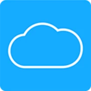

#  ha-mycloud

Home Assistant integration for Western Digital My Cloud NAS devices.

---

### Features
- **System Status**: Monitor CPU and memory usage of your My Cloud device.
- **Device Information**: See key details like serial number, name, and firmware version.
- **Disk Information**: See key details about disks, including their health status.
- **Volume Information**: View all volumes size, encryption status and more.

---

### Installation

#### HACS (Recommended)
1. Add this repository as a custom repository in HACS.
2. Search for "WD My Cloud" and install the integration.
3. Restart Home Assistant.

#### Manual
1. Copy the `custom_components/mycloud` folder into your Home Assistant `custom_components` directory.
2. Restart Home Assistant.

---

### Configuration
1. In the Home Assistant UI, go to **Settings** > **Devices & Services** > **Integrations**.
2. Click **Add Integration** and search for "WD My Cloud".
3. Follow the on-screen instructions to enter your device's host, username, and password.

---

### Sensors
The integration provides the following sensors:
- **WD My Cloud CPU Usage** (`sensor.wd_my_cloud_cpu_usage`)
- **WD My Cloud Memory Usage** (`sensor.wd_my_cloud_memory_usage`)
- **WD My Cloud Total Storage** (`sensor.wd_my_cloud_total_storage`)
- **WD My Cloud Used Storage** (`sensor.wd_my_cloud_used_storage`)
- **WD My Cloud Unused Storage** (`sensor.wd_my_cloud_unused_storage`)
- **[disk_name] Temperature** (`sensor.wd_my_cloud_disk_sda_temperature`) - a separate sensor is created for each disk
- **[disk_name] Size** (`sensor.wd_my_cloud_disk_sda_size`) - a separate sensor is created for each disk
- **[volume_name] Size** (`sensor.wd_my_cloud_volume_volume_1_size`) - a separate sensor is created for each volume

***

### Binary Sensors
The integration provides the following binary sensors:
- **[disk_name] Healthy** (`binary_sensor.wd_my_cloud_disk_sda_healthy`) - a separate binary sensor is created for each disk
- **[disk_name] Sleeping** (`binary_sensor.wd_my_cloud_disk_sda_sleeping`) - a separate binary sensor is created for each disk
- **[disk_name] Failed** (`binary_sensor.wd_my_cloud_disk_sda_failed`) - a separate binary sensor is created for each disk
- **[disk_name] Over Temperature** (`binary_sensor.wd_my_cloud_disk_sda_over_temperature`) - a separate binary sensor is created for each disk
- **[volume_name] Mounted** (`binary_sensor.wd_my_cloud_volume_volume_1_mounted`) - a separate binary sensor is created for each volume
- **[volume_name] Unlocked** (`binary_sensor.wd_my_cloud_volume_volume_1_unlocked`) - a separate binary sensor is created for each volume
- **[volume_name] Encrypted** (`binary_sensor.wd_my_cloud_volume_volume_1_encrypted`) - a separate binary sensor is created for each volume